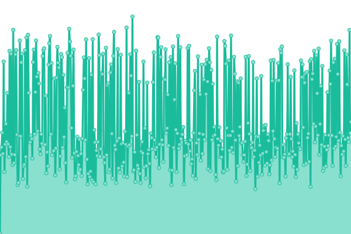
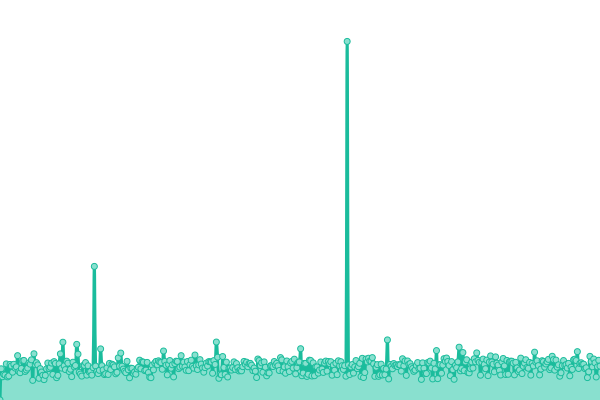
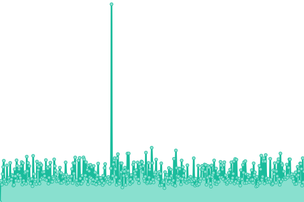
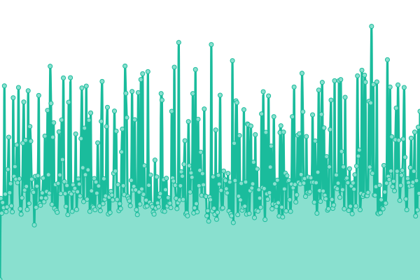

# Re:Earth Status Page

  

  <a href="https://reearth.io">Website</a>
  ·
  <a href="https://help.reearth.io">Documentation</a>
  ·
  <a href="https://www.figma.com/community/file/1027048965458642686">Figma</a>
  ·
  <a href="https://discord.gg/XJhYkQQDAu">Discord</a>

---

This repository contains the open-source uptime monitor and status page for [Re:Earth](https://reearth.io), powered by [Upptime](https://github.com/upptime/upptime).

With [Upptime](https://upptime.js.org), you can get your own unlimited and free uptime monitor and status page, powered entirely by a GitHub repository. We use [Issues](https://github.com/reearth/status/issues) as incident reports, [Actions](https://github.com/reearth/status/actions) as uptime monitors, and [Pages](https://reearth.github.io/status) for the status page.

<!--start: status pages-->
<!-- This summary is generated by Upptime (https://github.com/upptime/upptime) -->
<!-- Do not edit this manually, your changes will be overwritten -->
<!-- prettier-ignore -->
| URL | Status | History | Response Time | Uptime |
| --- | ------ | ------- | ------------- | ------ |
|  Re:Earth Classic | 🟩 Up | [re-earth-classic.yml](https://github.com/reearth/status/commits/HEAD/history/re-earth-classic.yml) | 

 442ms
     
 | 

<a href="https://status.reearth.io/history/re-earth-classic">100.00%</a>
    

|  Re:Earth Classic Earth Project | 🟩 Up | [re-earth-classic-earth-project.yml](https://github.com/reearth/status/commits/HEAD/history/re-earth-classic-earth-project.yml) | 

 408ms
     
 | 

<a href="https://status.reearth.io/history/re-earth-classic-earth-project">100.00%</a>
    

|  Re:Earth CMS | 🟩 Up | [re-earth-cms.yml](https://github.com/reearth/status/commits/HEAD/history/re-earth-cms.yml) | 

 683ms
     
 | 

<a href="https://status.reearth.io/history/re-earth-cms">100.00%</a>
    

|  Re:Earth Dashboard | 🟩 Up | [re-earth-dashboard.yml](https://github.com/reearth/status/commits/HEAD/history/re-earth-dashboard.yml) | 

 388ms
     
 | 

<a href="https://status.reearth.io/history/re-earth-dashboard">100.00%</a>
    

|  Re:Earth Visualizer | 🟩 Up | [re-earth-visualizer.yml](https://github.com/reearth/status/commits/HEAD/history/re-earth-visualizer.yml) | 

 549ms
     
 | 

<a href="https://status.reearth.io/history/re-earth-visualizer">100.00%</a>
    

|  Re:Earth Visualizer Project | 🟩 Up | [re-earth-visualizer-project.yml](https://github.com/reearth/status/commits/HEAD/history/re-earth-visualizer-project.yml) | 

 548ms
     
 | 

<a href="https://status.reearth.io/history/re-earth-visualizer-project">100.00%</a>
    

<!--end: status pages-->

## 📄 License

- Powered by: [Upptime](https://github.com/upptime/upptime)
- Code: [MIT](./LICENSE) © [Anand Chowdhary](https://anandchowdhary.com), supported by [Pabio](https://pabio.com)
- Data in the `./history` directory: [Open Database License](https://opendatacommons.org/licenses/odbl/1-0/)
